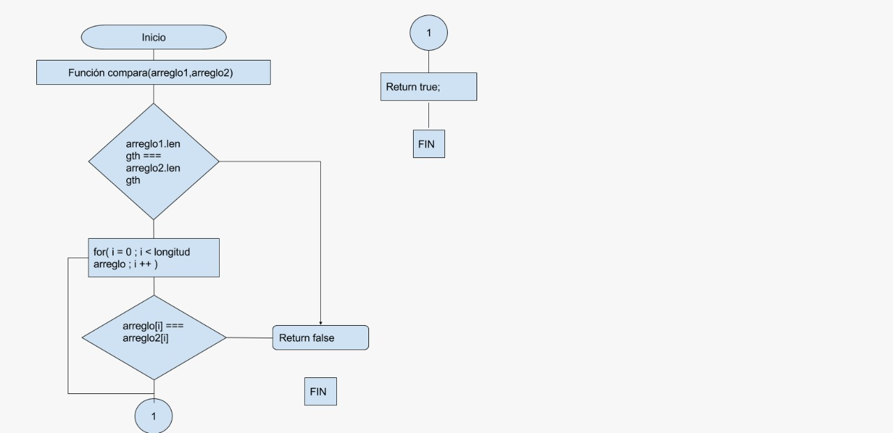

# Pseudocodigo

- 1.Crear una función que reciba 2 arreglos compo parametros
- 2.Comprobar que la longitud de los arreglos es diferente
-   2.1 si los arreglos no son iguales regreasar false
-     2.2 si tiene ka misma longitud continuar con el proeceso
- 3.Comprobar uno a uno los varores del arreglos
-   3.1 si no son iguakes regresa false
-     3.2 si son iguales continumos comprando uno a uno
- 4.Regresar true

